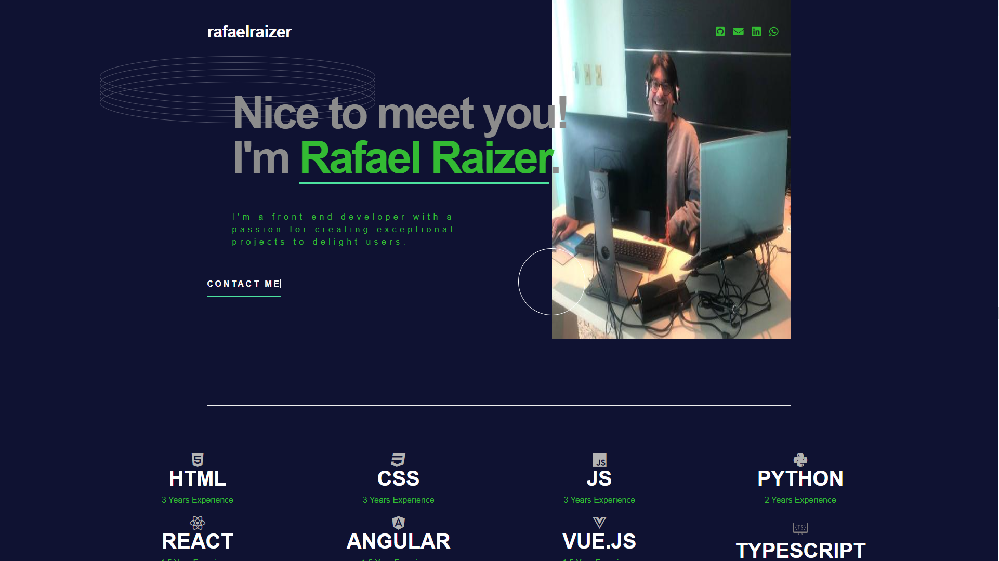

[](https://classroom.github.com/a/zcQQ-9EW)
[](https://classroom.github.com/online_ide?assignment_repo_id=13626416&assignment_repo_type=AssignmentRepo)
# modulo-Front-End-Projeto-final-html

 <div align="center">
 

[ ( Clique aqui e venha explorar => ```Looking at my portfolio!!!``) ](https://portfoliotech-rafarz76dev.vercel.app//)

<br>

<div align="center">
  
 [Demonstração-Portfolio_RafaRz76Dev 

 

